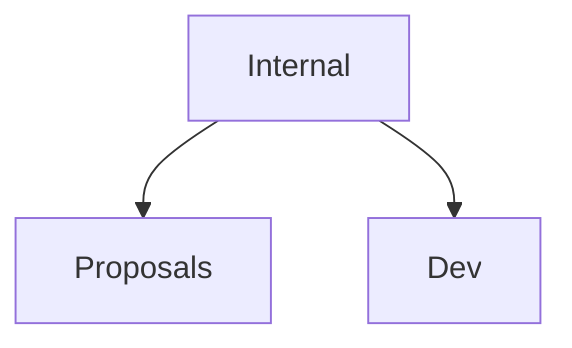

# E3 Project Management

1. Internal: the general information on the asset itself, who is responsible, what license, where is the repo(s), status, maintenance aspects, etc
2. Proposals: the content that could be reused in other proposals and in which projects it is being used or even mentioned (to avoid double funding)
3. Dev: coming back to the reusable libraries that Erik and Alenka were working on to make this work easy to use in other projects

## Map of Assets/Projects

## Assets

| Abb. | Asset Name | Description | Project(s) |
| --- | --- | --- | --- |
| AD     | Anomaly Detection | | Plooto |
| APy    | Anonipy | | PREPARE |
| TSFM   | Time Series Foundation Model | | Plooto |
| LLM-OG | LLM-powerd Ontology Generation | | HumAIne |
| MedNER | Medical Named Entity Recognition | | PREPARE, HumAIne |
| RAG-KG | RAG for KG | | HumAIne |
| SS     | StreamStory | | enrichMyData |

## Projects

| Project Name | Description | Use Cases | Technology |
| --- | --- | --- | --- |
| Plooto | | Manufacturing, Industry 4.0 | Classical / TS ML |
| enrichMyData | | AI |
| HumAIne | | Medical, Finance, Energy, Governance | Active Learning, NLP |
| PREPARE | | Medical |  |
