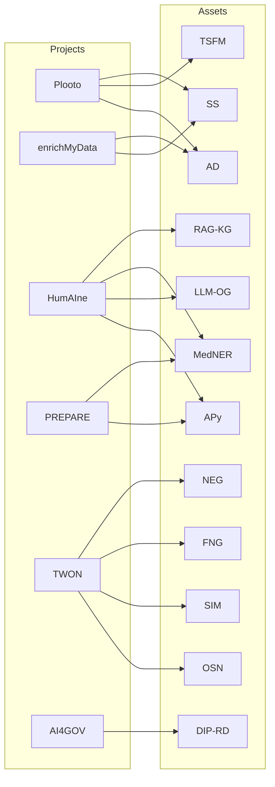

# E3 Project Management

1. Internal: the general information on the asset itself, who is responsible, what license, where is the repo(s), status, maintenance aspects, etc
2. Proposals: the content that could be reused in other proposals and in which projects it is being used or even mentioned (to avoid double funding)
3. Dev: coming back to the reusable libraries that Erik and Alenka were working on to make this work easy to use in other projects

## Map of Assets/Projects

## Assets

| Abb. | Asset Name | Project(s) | Responsible |
| --- | --- | --- | --- |
| AD     | Anomaly Detection | Plooto | Klemen |
| AL     | Active Learning | HumAIne | Klemen, Rokxx |
| APy    | Anonipy | PREPARE | Erik |
| TSFM   | Time Series Foundation Model | Plooto | Rok K. |
| LLM-OG | LLM-powerd Ontology Generation | HumAIne | Jože, Klemen |
| MedNER | Medical Named Entity Recognition | PREPARE, HumAIne | Erik |
| RAG-KG | RAG for KG | HumAIne | Domen |
| SS     | StreamStory | enrichMyData | Jan |
| DIP-RD | Data incompleteness pipeline | AI4Gov | Alenka |
| OSN    | Online social network (OSN) | TWON | Abdul |
| SIM    | OSN Simulation | TWON | Abdul |
| FNG    | Fake news generator | TWON | Luka G., Abdul |
| NEG    | Negotitaion plug-in agent | TWON | Martin Ž., Marko |

## Projects

| Project Name | Use Cases | Technology |
| --- | --- | --- |
| Plooto | Manufacturing, Industry 4.0 | Classical / TS ML |
| enrichMyData | | AI |
| HumAIne | Medical, Finance, Energy, Governance | Active Learning, NLP |
| PREPARE | Medical |  |
| TWON | Social Science | LLM
| AI4Gov | Public sector, Medical | Bias detection, education |
